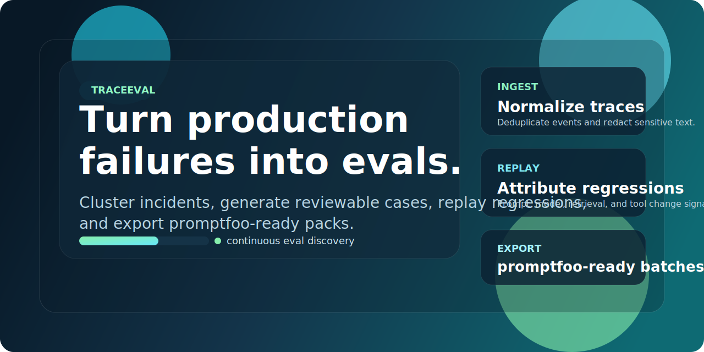
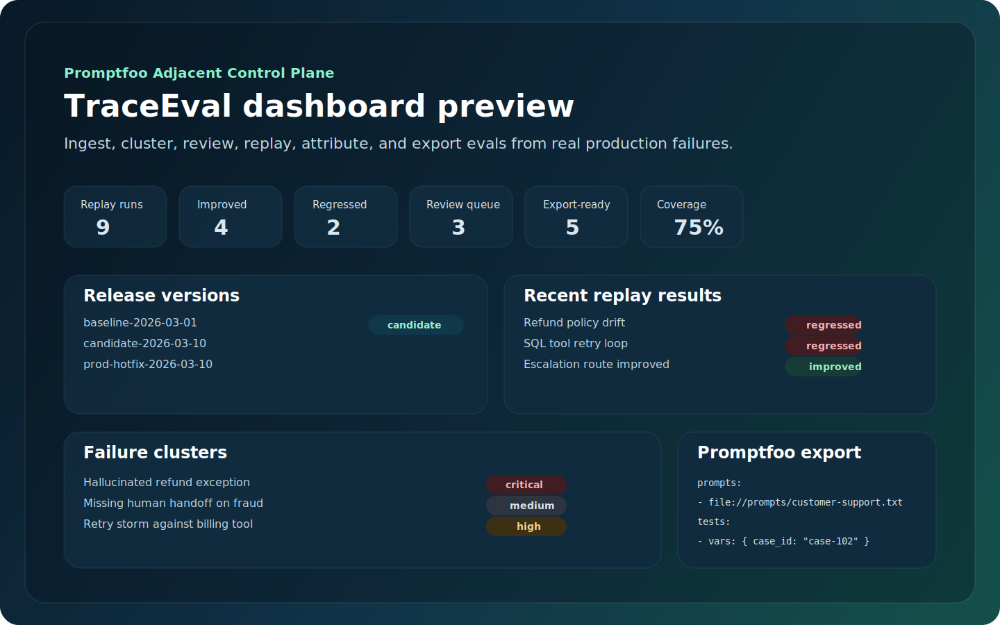

# TraceEval




[](https://github.com/manishklach/TraceEval/releases/latest)
[](./LICENSE)
[](./package.json)

TraceEval is a git-ready prototype for a product that complements [promptfoo](https://github.com/promptfoo/promptfoo) instead of competing head-on with its core evaluation engine.

The thesis is simple: `promptfoo` is already strong at running evals, red-team suites, and CI checks. The missing layer is **continuous eval discovery**: turning real production failures into canonical eval cases, replaying them against prompt or retrieval changes, and exporting the resulting suites into `promptfoo`.

This repo demonstrates that workflow with a small Node + SQLite app.

## Description

Trace-to-eval control plane that turns production failures into promptfoo-ready eval packs.

## Product Positioning

### What promptfoo already does well

- local and CI evaluation execution
- prompt/model comparison
- red teaming and security testing
- datasets and assertion-driven test suites
- tracing and inspection workflows

### What this prototype focuses on

- ingesting real-world traces, support transcripts, and escalation signals
- clustering incidents by likely root cause
- generating eval cases with lineage back to real incidents
- replaying cases across baseline vs candidate configurations
- exporting promptfoo-ready YAML packs

That makes this tool the layer **before** promptfoo and partially **around** promptfoo.

## MVP Workflow

1. Connect support and trace sources.
2. Normalize failures into `trace_events`.
3. Cluster related incidents into `failure_clusters`.
4. Generate canonical `eval_cases`.
5. Replay the cases across prompt/retriever versions.
6. Publish promptfoo export batches.

## v0.2 Priorities

The next build phase is documented in:

- [`docs/v0.2-plan.md`](./docs/v0.2-plan.md): implementation plan, milestones, success metrics, and build order
- [`docs/api-v0.2.md`](./docs/api-v0.2.md): concrete API shapes, entity states, and Postgres-oriented schema direction

The highest-priority advanced features for `v0.2` are:

- real ingestion adapters with idempotent normalization
- failure clustering with structured root-cause labels
- reviewable eval proposal generation with lineage
- replay and regression attribution across versioned releases
- deterministic promptfoo export batches

## Repo Layout

- `src/`: SQLite schema and HTTP server
- `public/`: dashboard UI showing the end-to-end workflow
- `scripts/seed.mjs`: deterministic sample data for the concept
- `scripts/export-preview.mjs`: generate an SVG preview for the dashboard concept
- `tests/`: API and seed validation
- `docs/`: architecture, roadmap, and implementation notes

## Run

```powershell
npm run seed
npm start
```

Open [http://localhost:3000](http://localhost:3000).

## Test

```powershell
npm test
```

## License

[MIT](./LICENSE)

## Endpoints

- `/api/health`
- `/api/dashboard`
- `/api/sample-db`
- `/api/promptfoo-export`

## Why this is a credible wedge

Most eval systems answer: "How did the suite do?"

This product answers the more valuable upstream question: "What should be in the suite next, based on what just broke in production?"

That is a distinct product surface, and it can integrate with `promptfoo` rather than replace it.

## Suggested Next Builds

- ingest adapters for Langfuse, Helicone, Intercom, Zendesk, or OpenAI response logs
- clustering pipeline using embeddings plus rules for tool errors and policy violations
- approval flow for human review before exporting new evals
- direct `promptfoo` file generation and PR creation
- regression bisection that attributes quality deltas to prompt, model, retrieval, or tool changes

See [`docs/architecture.md`](./docs/architecture.md), [`docs/roadmap.md`](./docs/roadmap.md), [`docs/v0.2-plan.md`](./docs/v0.2-plan.md), and [`docs/api-v0.2.md`](./docs/api-v0.2.md) for the fuller product spec.

## Roadmap Tracking

The public backlog is tracked in GitHub through the [TraceEval v0.2 milestone](https://github.com/manishklach/TraceEval/milestone/1) and its starter roadmap issues.

## Contributing

See [CONTRIBUTING.md](./CONTRIBUTING.md) for setup, workflow expectations, and PR guidance.
